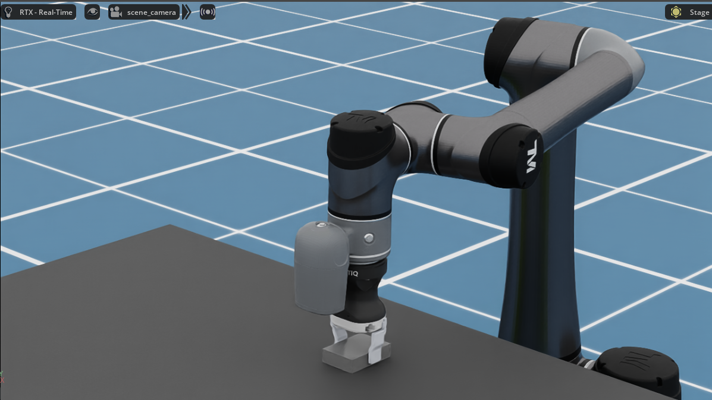
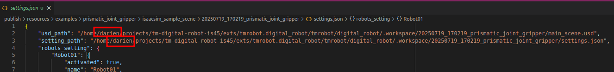
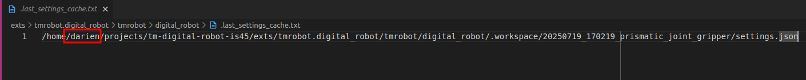
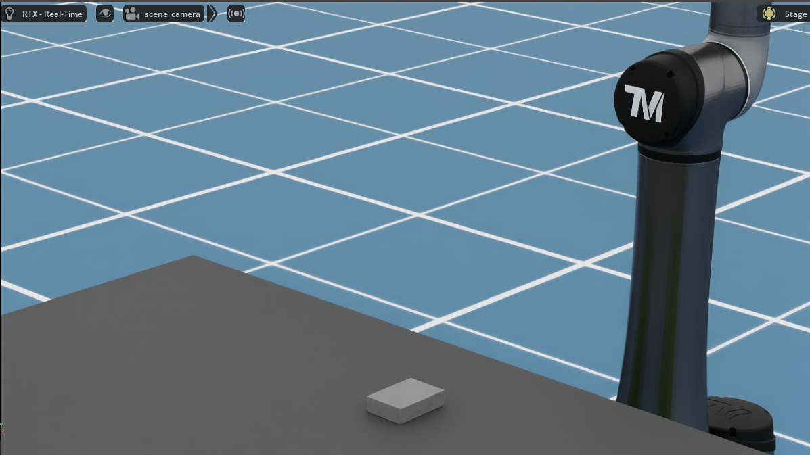
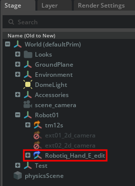
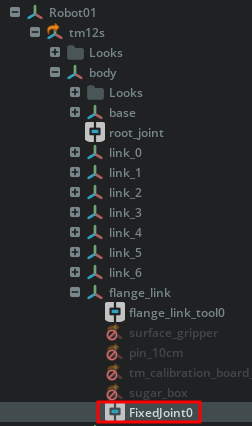
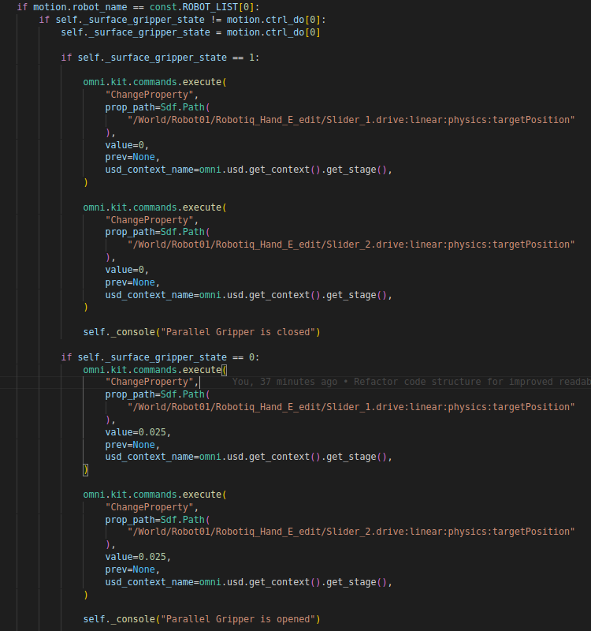

# Case 6: Example of Prismatic Joint Gripper

This case demonstrates how to integrate a prismatic joint gripper, Roboiq Hand-E with the TM Digital Robot. It may serve as inspiration for adapting other prismatic joint grippers in your own project.



## How to Set Up the Example

### 1. Import the TMflow Project to Your Simulator

-   Navigate to the TMflow project folder:

    ```bash
    # Ubuntu path
    ~/projects/tm-digital-robot-is45-publish/examples/prismatic_joint_gripper/tmflow_sample_project
    ```

    ```bash
    # Windows path
    %USERPROFILE%\projects\tm-digital-robot-is45-publish\examples\prismatic_joint_gripper\tmflow_sample_project
    ```

-   Copy the `TM_Export` folder to a USB drive and import it into your TM simulator.

### 2. Restore the Sample Scene to Workspace

-   Locate the sample scene folder:

    ```bash
    # Ubuntu path
    ~/projects/tm-digital-robot-is45-publish/examples/prismatic_joint_gripper/isaacsim_sample_scene
    ```

    ```bash
    # Windows path
    %USERPROFILE%\projects\tm-digital-robot-is45-publish\examples\prismatic_joint_gripper\isaacsim_sample_scene
    ```

-   Copy the folder `20250719_170219_prismatic_joint_gripper` to your workspace:

    ```bash
    # Ubuntu path
    ~/projects/tm-digital-robot-is45-publish/exts/tmrobot.digital_robot/tmrobot/digital_robot/.workspace/
    ```

    ```bash
    # Windows path
    %USERPROFILE%\projects\tm-digital-robot-is45-publish\exts\tmrobot.digital_robot\tmrobot\digital_robot\.workspace\
    ```

### 3. Update Paths in `settings.json`

-   Open the following file with a text editor:

    ```bash
    # Ubuntu path
    ~/projects/tm-digital-robot-is45-publish/exts/tmrobot.digital_robot/tmrobot/digital_robot/.workspace/20250719_170219_prismatic_joint_gripper/settings.json
    ```

    ```bash
    # Windows path
    %USERPROFILE%\projects\tm-digital-robot-is45-publish\exts\tmrobot.digital_robot\tmrobot\digital_robot\.workspace\20250719_170219_prismatic_joint_gripper\settings.json
    ```

-   Replace the username `darien` in the paths with your own username. Make sure the `usd_path` and `setting_path` are valid and accessible.

    

### 4. Update the Path in `.last_settings_cache.txt`

-   Open the file with a text editor:

    ```bash
    # Ubuntu paths
    ~/projects/tm-digital-robot-is45-publish/exts/tmrobot.digital_robot/tmrobot/digital_robot/.last_settings_cache.txt
    ```

    ```bash
    # Windows path
    %USERPROFILE%\projects\tm-digital-robot-is45-publish\exts\tmrobot.digital_robot\tmrobot\digital_robot\.last_settings_cache.txt
    ```

-   Replace the username `darien` in the path with your own username, and ensure the file path points `settings.json`.

    

### 5. Replace the existing `extension.py` File

-   Backup or rename the existing `extension.py` file in the TM Digital Robot extension folder:

    ```bash
    # Ubuntu path
    ~/projects/tm-digital-robot-is45-publish/exts/tmrobot.digital_robot/tmrobot/digital_robot/extension.py
    ```

    ```bash
    # Windows path
    %USERPROFILE%\projects\tm-digital-robot-is45-publish\exts\tmrobot.digital_robot\tmrobot\digital_robot\extension.py
    ```

-   Copy the example of extension.py of prismatic joint gripper below to the TM Digital Robot extension folder:

    ```bash
    # Ubuntu path
    ~/projects/tm-digital-robot-is45-publish/examples/prismatic_joint_gripper/extension.py
    ```

    ```bash
    # Windows path
    %USERPROFILE%\projects\tm-digital-robot-is45-publish\examples\prismatic_joint_gripper\extension.py
    ```

-   Save the the new extension.py in the TM Digital Robot extension folder.

### 6. Load the Sample Scene

-   In Isaac Sim, open the TM Digital Robot extension panel and click the `Load` button.
-   If all steps are correct, the scene will appear with a gray workpiece under the table, like this:

    

### 6. Run the TM Simulator and Start the Simulation

-   In the TM Simulator, run the project you imported.
-   In the TM Digital Robot extension panel, click `Start` to begin the simulation.
-   If everything is set up properly, the robot arm will pick up the gray workpiece and place it on the table, like this video:

    [Demo Video](images/prismatic_Joint_gripper.webm)

---

Congratulations! You've successfully set up the prismatic joint gripper example with TM Digital Robot.

The configurations and how prismatic joins assembled for the `Roboiq Hand-E` gripper can be found under `Robot1` [Ref.1], and gripper control (open/close) logic can be found in `extension.py` [Ref.2].

-   [Ref.1] Hint: Required a fixed joint to connect the gripper to the robot arm, to avoid the nested Articulation root.

    

    

-   [Ref.2]

    
