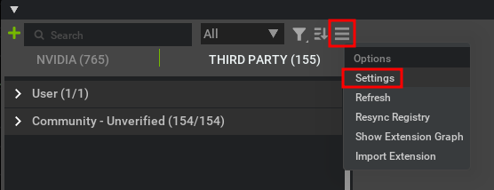
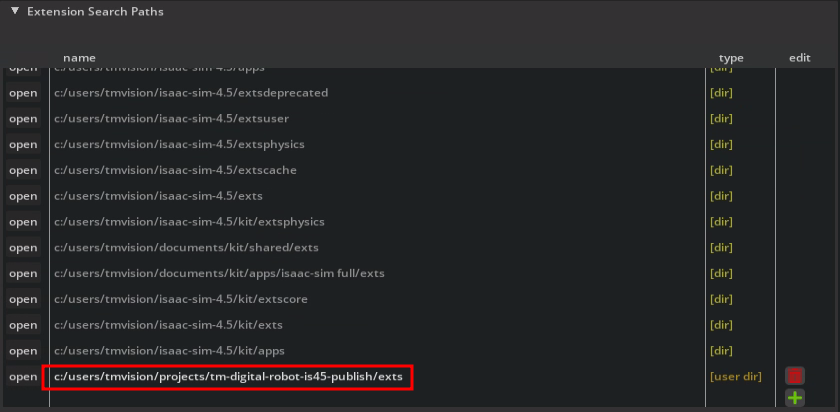
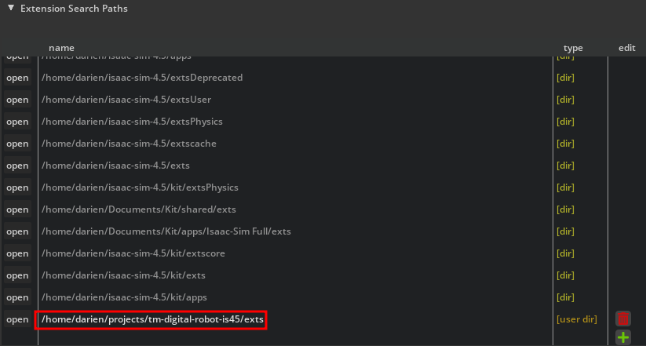
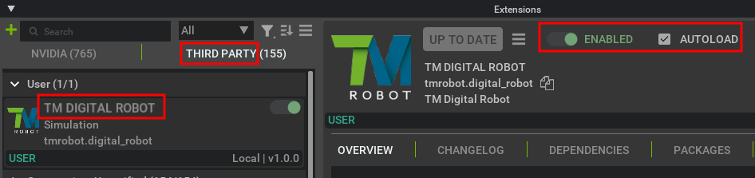
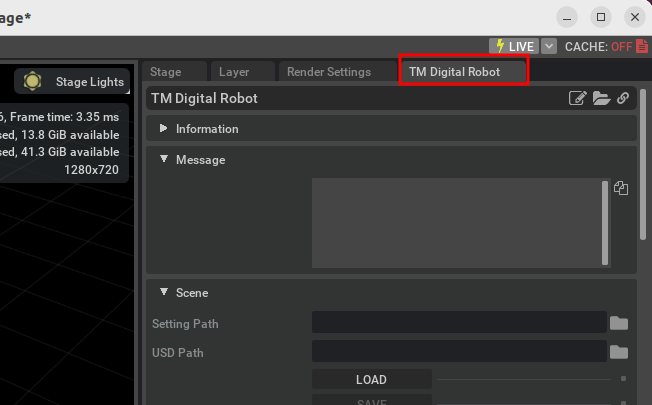

# TM Digital Robot Extension Installation

1. Start Isaac Sim.
2. Open **Window -> Extensions** from the top menu.
3. Click the hamburger icon, then select **Settings** to open **Extensions Search Paths** window.

    

4. Click **Add** (the small green plus sign icon on the right), then enter the path where you cloned the TM Digital Robot Extension code in the previous step. Ensure the path ends with **/exts**.

    - Example for Windows:

        

    - Example for Ubuntu:

        

5. Go to the **THIRD PARTY** tab, locate **TM Digital Robot Extension**, toggle **ENABLED**, and enable **AUTOLOAD**.

    

6. A new **TMRobot** menu will appear. Click **TM Digital Robot** to open the extension.

    

7. Drag and dock the extension to the right side for easy access.

    

8. Installation is complete.

## Next Step

-   Proceed to [Setup TMSimulator](SETUP_TMSIMULATOR.md) for the next steps.
