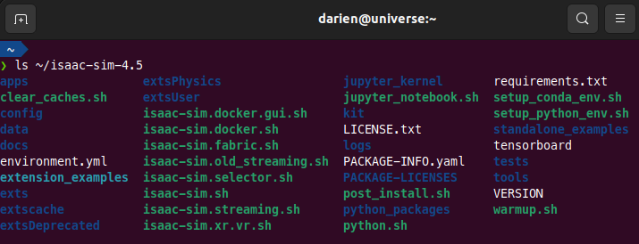
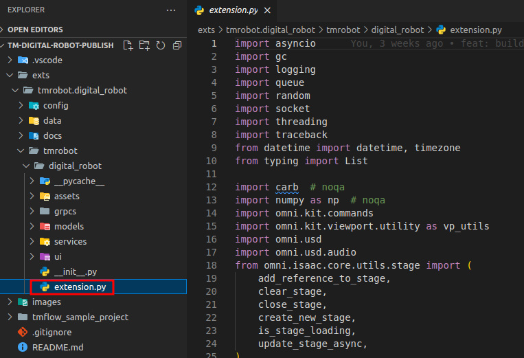

# Isaac Sim Installation guide for Ubuntu

## Download the TM Digital Robot Extension

```bash
mkdir -p ~/projects
cd ~/projects
git clone https://github.com/tm-vision/tm-digital-robot-is45-publish
cd ~/projects/tm-digital-robot-is45-publish
```

-   Please checkout the latest or specific version and then create new branch for your custom development
-   Checkout the latest version, you can use the command below

```bash
git checkout v2.23.1
git branch v2.23.1_custom
git checkout v2.23.1_custom
```

## Install the Isaac Sim

## Install Isaac Sim

-   Download the Linux version of Isaac Sim (6.7 GB) from the [Latest Release](https://docs.isaacsim.omniverse.nvidia.com/4.5.0/installation/download.html#latest-release).
-   Unzip it to your home directory and rename the folder to **isaac-sim-4.5**.
-   Verify the installation with the following command:

```bash
ls ~/isaac-sim-4.5
```

## Link Isaac Sim SDK

-   For convenenit to use install sense as coding, we can link isaac sim sdk to our project

```bash
cd ~/projects/tm-digital-robot-is45-publish
mkdir sdk_isaacsim
cd sdk_isaacsim
ln -s ~/isaac-sim-4.5/exts
ln -s ~/isaac-sim-4.5/extscache
ln -s ~/isaac-sim-4.5/kit
```

-   Then, we need to install python modules required

```bash
cd ~/projects/tm-digital-robot-is45-publish
~/isaac-sim-4.5/kit/python/bin/python3 -m pip install --upgrade pip
~/isaac-sim-4.5/kit/python/bin/python3 -m pip install --isolated --no-cache-dir --no-deps -r requirements.txt

ls -al  ~/isaac-sim-4.5/kit/python/bin/python3
```

### Start Isaac Sim

-   To start isaac sim by command below

```bash
cd ~/isaac-sim-4.5
./isaac-sim.sh
```

-   If everything alright, you should see the Isaac Sim window, it means you have successfully installed Isaac Sim

    

## Open the source code by Visual Studio Code

-   Open your source code by command below

```bash
cd ~/projects/tm-digital-robot-is45-publish
code .
```

-   You should see the Visual Studio Code window with the source code, the extension.py that allows you customize as you need

    

## Next step

-   Next, please go to [Installation of TM-Digital Robot Extension](INSTALL_EXTENSION.md) for the following step
