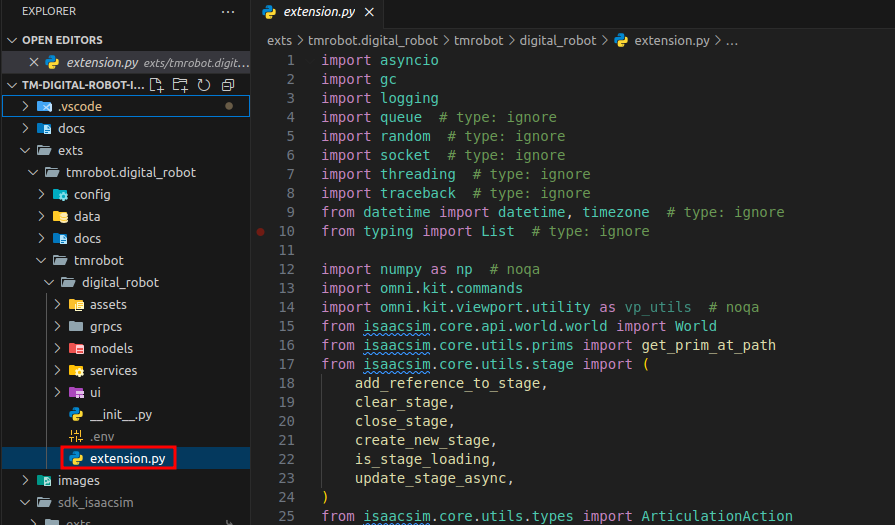
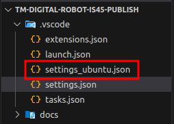

# Extension Code Setup for Ubuntu

## 1. Clone the TM Digital Robot Extension Code

-   Create a directory for your projects and clone the repository:

```bash
mkdir -p ~/projects
cd ~/projects
git clone https://github.com/tm-vision/tm-digital-robot-is45-publish
```

-   Check out the latest or a specific version, then create a new branch for custom development:

```bash
cd ~/projects/tm-digital-robot-is45-publish
git checkout v2.23.2
git branch v2.23.2_custom
git checkout v2.23.2_custom
```

## 2. Link Isaac Sim SDK

-   For easier development, link the Isaac Sim SDK to the project directory:

```bash
cd ~/projects/tm-digital-robot-is45-publish
mkdir sdk_isaacsim
cd sdk_isaacsim
ln -s ~/isaac-sim-4.5/exts
ln -s ~/isaac-sim-4.5/extscache
ln -s ~/isaac-sim-4.5/kit
```

## 3. Install Required Python Modules

-   Install the necessary Python modules by running the following commands:

```bash
cd ~/projects/tm-digital-robot-is45-publish
~/isaac-sim-4.5/kit/python/bin/python3 -m pip install --no-warn-script-location --upgrade pip
~/isaac-sim-4.5/kit/python/bin/python3 -m pip install --no-warn-script-location --isolated --no-cache-dir --no-deps -r requirements.txt
```

## Open the source code by Visual Studio Code

-   Open your source code by command below

```bash
cd ~/projects/tm-digital-robot-is45-publish
code .
```

-   You should see the Visual Studio Code window with the source code, the extension.py that allows you customize as you need

    

-   There is a settings template, **settings_ubuntu.json**, for Ubuntu. You can replace it with **settings.json**.

    

## 4. Next Step

-   Continue to [Install Extension](INSTALL_EXTENSION.md) for further steps.
