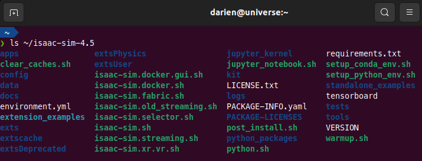

# Isaac Sim Installation for Ubuntu

## 1. Download Isaac Sim 4.5

-   Download the Linux version of Isaac Sim (6.7 GB) from the [Latest Release](https://docs.isaacsim.omniverse.nvidia.com/4.5.0/installation/download.html#latest-release).
-   Extract the downloaded file to your home directory and rename the folder to **isaac-sim-4.5**.
-   Verify the installation by running the following command. You should see the files listed as shown below:

```bash
ls ~/isaac-sim-4.5
```



### 2. Start Isaac Sim

-   To launch Isaac Sim, run the following commands:

```bash
cd ~/isaac-sim-4.5
./isaac-sim.sh
```

-   If everything is set up correctly, the Isaac Sim window should appear, indicating that the installation was successful.

    

-   It's a great idea to create a desktop shortcut for easy access later.

    

## 3. Next Step

-   Proceed to the [Setup Source Code](INSTALL_UBUNTU_CODE.md) for the next steps.
