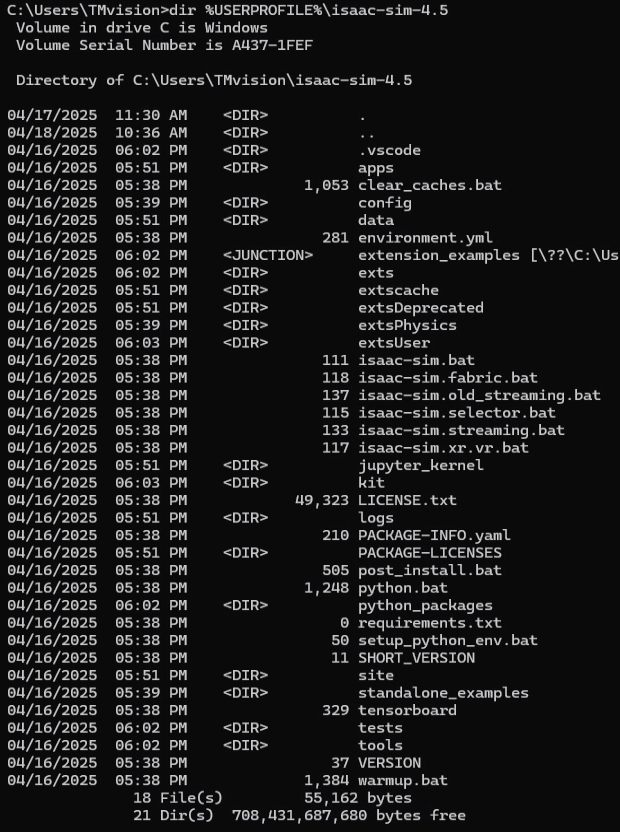
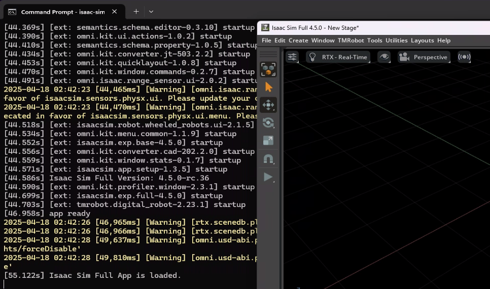

# Isaac Sim Installation for Windows

## 1. Download Isaac Sim 4.5

-   Download the Windows version of Isaac Sim (6.5 GB) from the [Latest Release](https://docs.isaacsim.omniverse.nvidia.com/4.5.0/installation/download.html#latest-release).
-   Extract the downloaded file to your home directory and rename the folder to **isaac-sim-4.5**.
-   Verify the installation by running the following command. You should see the files listed as shown below:

```bash
dir %USERPROFILE%\isaac-sim-4.5
```



### Start Isaac Sim

```bash
cd %USERPROFILE%\isaac-sim-4.5
isaac-sim.bat
```

-   If everything alright, you should see the Isaac Sim window, it means you have successfully installed Isaac Sim

    

## 3. Next Step

-   Proceed to the [Setup Source Code](INSTALL_UBUNTU_CODE.md) for the next steps.
